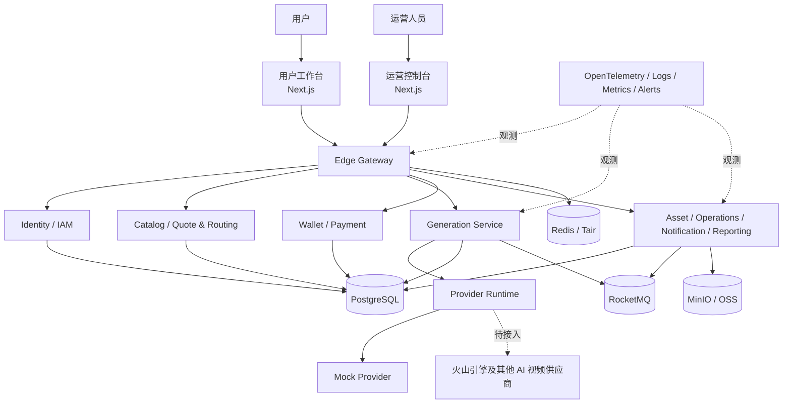

# AI 视频聚合平台

> 面向中国大陆市场的 AI 视频生成聚合平台，为用户提供统一的生成工作台，为运营团队提供可配置、可审计的管理控制台。

本项目通过统一能力模型接入不同 AI 视频供应商，将模型参数、智能路由、任务执行、点数结算、资产管理和运营治理整合到同一套平台中。系统采用可横向扩展的微服务架构，本地可通过 Mock Provider 完成闭环验证，生产环境规划部署到阿里云。

## 项目状态

当前代码位于**集成加固和上线准备阶段**，GitHub 默认开发分支为 `develop`。仓库已包含用户端、运营后台、核心领域服务、本地联调环境、可观测性和阿里云基础设施代码，但尚未完成真实外部账号与生产凭据配置。

| 范围                   | 当前状态                       | 说明                                                 |
| ---------------------- | ------------------------------ | ---------------------------------------------------- |
| 用户工作台与运营控制台 | 已有代码基线                   | 仍需在目标环境执行完整验收                           |
| AI 视频生成闭环        | Mock 可联调                    | 真实供应商接口将在取得官方文档和凭据后逐一接入       |
| 火山引擎               | 待接入                         | 已确认存在分销商点数折扣，尚未提交真实接口配置       |
| 钱包与微信支付         | 领域能力已实现，外部配置待完成 | 本地使用测试支付；生产商户号、证书和回调域名尚待开通 |
| 阿里云部署             | IaC、Helm 和 Runbook 已具备    | 云账号、域名、证书、KMS 密钥和生产资源尚待配置与验收 |
| 生产发布               | 未完成                         | 不应将当前仓库状态视为已通过生产验收                 |

## 产品能力

### 用户工作台

- 手机号登录、账号安全、会话与设备管理。
- 模型广场、价格中心、帮助中心和平台内容展示。
- 智能模式自动路由，以及专业模式手动选择供应商和模型。
- 基于供应商能力 Schema 动态生成参数表单，覆盖文生视频、图生视频、首尾帧、参考视频和视频延长等能力类型。
- 提交前报价、点数预冻结、任务结算、失败退款和不可变钱包流水。
- 任务状态追踪、SSE 更新、轮询降级、取消、复制参数和重新生成。
- 私有素材与作品管理、对象存储直传、短时访问链接和生命周期控制。
- 充值订单、发票申请、站内消息、反馈和工单。

### 运营控制台

- 经营指标、任务质量、收入、成本、毛利、供应商余额和告警总览。
- 用户查询、封禁、设备与登录记录、钱包流水及双人复核点数调整。
- 供应商、鉴权方式、回调、密钥引用、采购折扣、余额与健康状态管理。
- 模型映射、动态能力 Schema、草稿发布、版本差异和回滚。
- 定价规则、最低毛利保护、智能路由权重、故障降级和决策审计。
- 全量任务检索、脱敏请求追踪、重试、切换、补偿、退款和队列治理。
- 支付、账本、退款、对账、发票，以及按用户、模型和供应商统计经营数据。
- 超级管理员、自定义后台用户、角色、权限点、数据范围、双因素认证和操作审计。

完整产品边界以[平台设计规范](docs/superpowers/specs/2026-08-28-ai-video-aggregation-platform-design.md)为准。

## 交付边界

以下能力不在当前范围内：

- 面向客户的开放 API。
- iOS、Android 原生应用。
- 海外支付、多币种及国际化运营。
- 会员订阅、团队或企业工作空间。
- 平台自建内容审核、本地 AI 推理、模型训练或 GPU 渲染。
- 在线视频编辑器和社区社交功能。
- 第三方电子税务开票 API。

## 系统架构



外部请求统一进入 Edge Gateway；领域服务分别拥有自己的业务边界和数据；生成任务通过 Provider Runtime 调用供应商适配器，并通过事件、幂等和对账机制收敛任务与财务状态。

## 仓库结构

这是一个由 pnpm workspace 和 Turborepo 管理的 TypeScript Monorepo。各服务保持独立构建与部署能力。

```text
apps/
  user-web/                 用户工作台
  admin-web/                运营控制台
services/
  edge-gateway/             统一入口、鉴权、限流和路由
  identity-service/         用户身份与会话
  iam-service/              后台账号、角色和权限
  catalog-service/          供应商、模型和能力目录
  quote-routing-service/    报价、毛利保护和智能路由
  generation-service/       生成任务生命周期与编排
  provider-runtime/         供应商适配器执行边界
  wallet-service/           点数账本、冻结、结算和退款
  payment-service/          支付订单、回调和对账
  asset-service/            素材、作品和对象存储
  operations-service/       运营操作、工单和审计支持
  notification-service/     站内信与短信通知
  reporting-service/        经营报表与观测投影
providers/
  mock-provider/            本地生成供应商模拟器
packages/                   契约、能力 Schema、SDK、UI 与公共工具
infra/                      Docker Compose、Terraform 和 Helm
docs/                       设计规范、实施计划和生产 Runbook
tests/                      跨服务契约与端到端验证
```

## 技术栈

| 层级       | 主要技术                                                      |
| ---------- | ------------------------------------------------------------- |
| 前端       | Next.js 16、React 19、TypeScript                              |
| 服务端     | Node.js 24、NestJS 风格独立服务、REST/JSON、SSE               |
| 数据与消息 | PostgreSQL、Redis/Tair、RocketMQ                              |
| 对象存储   | 本地 MinIO；生产 OSS + CDN                                    |
| 工程化     | pnpm 11.24.0、Turborepo、ESLint、Prettier、Vitest、Playwright |
| 可观测性   | OpenTelemetry、结构化日志、指标、告警与经营投影               |
| 部署       | Docker、Terraform、Helm、阿里云 ACR/ACK/KMS                   |

## 快速开始

### 环境要求

- Node.js `>=24 <25`，推荐使用仓库当前验证版本 `24.15.0`。
- Corepack 与 pnpm `11.24.0`。
- Docker Desktop，支持 Docker Compose v2。
- Git。

### 1. 克隆与安装

```bash
git clone https://github.com/zhuJude/ai-video-aggregation-platform.git
cd ai-video-aggregation-platform
git checkout develop
corepack enable
corepack prepare pnpm@11.24.0 --activate
pnpm install --frozen-lockfile
```

### 2. 准备本地环境变量

PowerShell：

```powershell
Copy-Item infra/local/.env.example infra/local/.env
```

Bash：

```bash
cp infra/local/.env.example infra/local/.env
```

示例文件仅包含本地开发配置，不得替换为生产密钥后提交到 Git。

### 3. 启动本地依赖

只启动 PostgreSQL、Redis、RocketMQ、MinIO 和 Mailpit：

```bash
docker compose --env-file infra/local/.env -f infra/local/compose.yaml up -d
```

如需以容器方式启动完整本地服务栈：

```bash
docker compose --env-file infra/local/.env -f infra/local/compose.yaml -f infra/local/compose.services.yaml up --build
```

主要入口：

- 用户工作台：<http://localhost:3100>
- 运营控制台：<http://localhost:3101>
- Edge Gateway：<http://localhost:3102>
- MinIO Console：<http://localhost:9001>
- Mailpit：<http://localhost:8025>

### 4. 在宿主机启动开发进程

已经启动基础依赖后，可执行：

```bash
pnpm dev
```

各应用和服务的运行配置不同；进行单服务开发时，应同时阅读对应目录的 `package.json` 和相关 Runbook。

### 5. 执行质量门禁

```bash
pnpm verify
```

该命令统一执行格式、静态检查、类型检查、测试和构建验证。提交或发布前必须在目标环境重新执行，不能以历史结果代替当前验收。

## 常用命令

| 命令                 | 用途                         |
| -------------------- | ---------------------------- |
| `pnpm dev`           | 并行启动支持开发模式的工作区 |
| `pnpm build`         | 构建全部工作区               |
| `pnpm lint`          | 执行代码规范检查             |
| `pnpm typecheck`     | 执行 TypeScript 类型检查     |
| `pnpm test`          | 执行根级与工作区测试         |
| `pnpm test:coverage` | 生成测试覆盖率结果           |
| `pnpm format:check`  | 检查格式                     |
| `pnpm verify`        | 执行统一交付门禁             |

## Git 协作

- `develop`：当前默认分支和技术协作基线。
- `main`：保留早期项目基线，当前不作为最新开发入口。
- 新工作从最新 `develop` 创建独立功能分支，推荐使用 `codex/<scope>` 或团队统一的命名规则。
- 提交前至少运行与改动范围对应的测试；准备合并前执行 `pnpm verify`。
- 不直接提交真实密钥、证书、商户配置、云账号信息或用户数据。
- 涉及契约、数据库、财务规则或基础设施的修改，应同步更新相关文档和迁移/回滚方案。

推荐流程：

```bash
git switch develop
git pull --ff-only
git switch -c codex/your-change
# 修改并验证
git push -u origin codex/your-change
```

## 部署与运维

生产目标环境为阿里云，基础设施由 Terraform 管理，应用通过 Helm 部署到 ACK。部署前必须完成云账号、远程 State、GitHub OIDC、域名、证书、KMS Secret、数据库迁移、预算告警和灰度回滚配置。

不要只根据 README 操作生产环境。完整步骤请阅读[阿里云生产部署与恢复 Runbook](docs/runbooks/deployment.md)。

## 文档索引

### 设计与执行

- [平台总体设计规范](docs/superpowers/specs/2026-08-28-ai-video-aggregation-platform-design.md)
- [总体执行计划](docs/superpowers/plans/2026-08-28-00-program-execution-plan.md)
- [集成加固与上线实施计划](docs/superpowers/plans/2026-08-28-ws20-integration-hardening-launch-implementation.md)

### 生产 Runbook

- [Edge Gateway](docs/runbooks/edge-gateway.md)
- [Identity 与 IAM](docs/runbooks/identity-iam.md)
- [Catalog 与 Routing](docs/runbooks/catalog-routing.md)
- [Generation 与 Provider Runtime](docs/runbooks/generation-provider.md)
- [Wallet 与 Payment](docs/runbooks/wallet-payment.md)
- [Supporting Services](docs/runbooks/supporting-services.md)
- [Reporting 与 Observability](docs/runbooks/observability.md)
- [部署、回滚与恢复](docs/runbooks/deployment.md)

## 安全说明

- 仓库内的 `local-*`、Mock 密钥和本地证书只用于隔离开发与测试，不得用于生产。
- 生产密钥应存储在阿里云 KMS/Secret Manager，并通过最小权限工作负载身份访问。
- 供应商原始请求、响应和敏感字段必须按权限展示并脱敏审计。
- 如发现安全问题，请通过仓库所有者指定的私密渠道报告，不要在公开 Issue 中披露凭据或用户数据。

## License

本项目暂未声明开源许可证。除非仓库所有者另行书面授权，不得复制、分发或用于商业用途。
